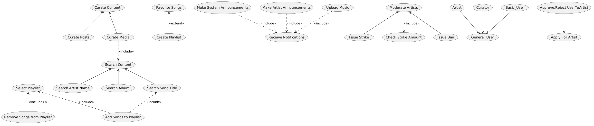

# Use Case Model

[UML]
(Search Content) <-- (Search Artist Name)
  (Search Content) <-- (Search Album )
  (Search Content) <-- (Search Song Title)

  (Favorite Songs) <.. (Create Playlist) : <<extend>>

  (Select Playlist) <.. (Add Songs to Playlist) : <<include>>
  (Search Song Title) <.. (Add Songs to Playlist) : <<include>>
  (Select Playlist) <.. (Remove Songs from Playlist) : <include>>
  
  
  (Curate Content) <-- (Curate Posts)
  (Curate Content) <-- (Curate Media)
  (Curate Media) ..> (Search Content) : <<include>>

  (Make System Announcements) ..> (Receive Notifications) : <<include>>
  (Make Artist Announcements) ..> (Receive Notifications) : <<include>>
  (Upload Music) ..> (Receive Notifications) : <<include>>

  (Moderate Artists) <-- (Issue Strike)
  (Moderate Artists) ..> (Check Strike Amount) : <<include>>
  (Moderate Artists) <-- (Issue Ban)

    (Artist) --> (General_User) 
  (Curator) --> (General_User)
  (Basic_User) --> (General_User)

  (Approve/Reject UserToArtist) ..> (Apply For Artist)
}

@enduml

[Εικόνα]

# Επεξήγηση των Use Cases
[θα γραψω την εξηγηση οταν καταληξουμε σε ενα τελικο UCD, πρεπει κιολας να ψαξω το πως περιγραφω UC οταν εχουμε γενικευση, επεκταση κι ολα τα σχετικα]